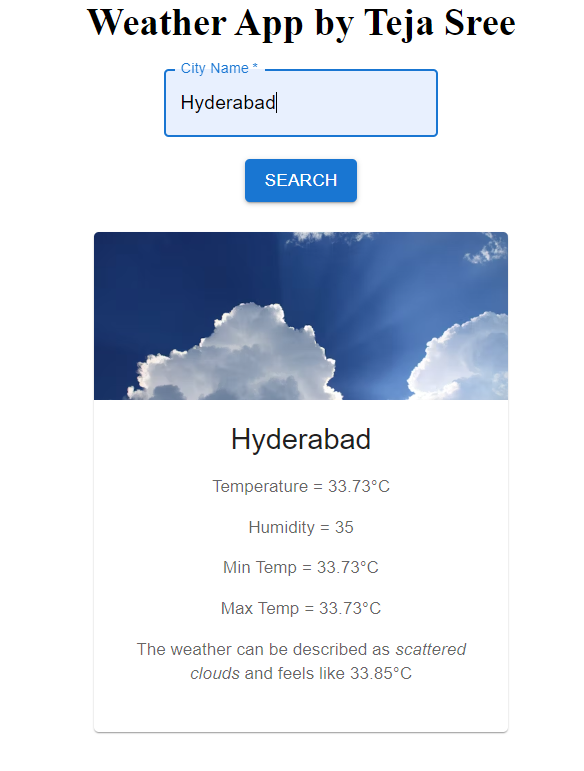

# Weather App 

## Overview

This Weather App is a simple web application that allows users to check the current weather conditions for a specific city. It provides real-time data on temperature, humidity, and weather description.

## Features

- Current Weather: Display the current temperature, humidity, and weather description for a specified city.
- Dynamic Background: Background image changes based on weather conditions (e.g., sunny, rainy, cold).
- Search Functionality: Users can search for weather information for any city.
- Responsive Design: The app is optimized for various screen sizes, including mobile devices.

## Technologies Used

- Frontend: React.js, Material-UI for UI components
- API: Integrated with a weather API to fetch real-time weather data
- Styling: Custom CSS for additional styling
- Deployment: Deployed on [Platform Name] (e.g., Heroku, Netlify)

## Getting Started

### Prerequisites

Before you begin, ensure you have the following prerequisites:

- Web browser (e.g., Chrome, Firefox, Safari)
- Text editor (e.g., Visual Studio Code, Sublime Text)

### Installation

To run this project locally, follow these steps:

1. Clone the repository: git clone https://github.com/PallepatiTejaSree/Weather-App.git
2. Navigate to the project directory: cd your-repository
3. Install dependencies: npm install
4. Start the development server: npm start

## Author

Pallepati Teja Sree